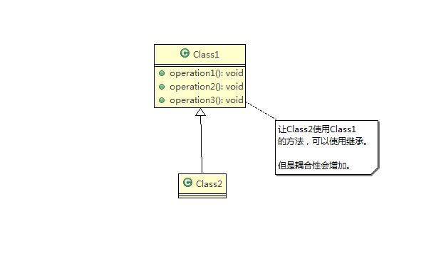
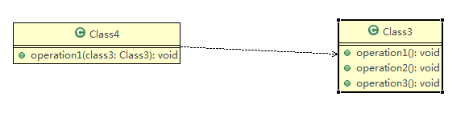
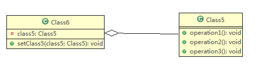
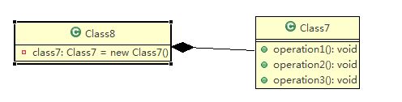

## 一 设计模式的目的

设计模式是对软件设计中普遍或反复存在的各种问题，所提出的解决方案。

其目的是为了让程序具有更好的：

* 可重用性
* 可读性
* 可扩展性
* 可靠性
* 高内聚、低耦合


## 二 设计模式七大原则

### 1 单一职责原则

**注：本节实例参看工程中com.lovestory.dm.principle.single_responsibility包**

#### 1.1 简述

对类来说，一个类应该只负责一项职责。

对方法来说，一个方法只负责一项职责。


#### 1.2 注意事项和细节

a. 降低类的复杂度，即一个类只负责一项职责。

b. 提高类的可读性和可维护性。

c. 降低变更引起的风险。

d. 通常情况下应该遵守单一职责原则。

* 如果逻辑简单，可以在代码级违反单一职责原则。

* 如果类中方法足够少，可以在方法级别保持单一职责原则。


#### 1.3 示例

##### 1.3.1 未遵循单一原则

Vehicle类的run方法希望表现出每种交通工具的运动方式。
随着交通工具种类增加或者修改，有可能需要新增或修改其运动方式，直接在Vehicle类中修改会带来一些风险。
该情况增加了类的复杂度，可读性不高，目的性不明显，违反了单一原则。

```java
SR1_SingleResponsibility.java

package com.lovestory.dm.principle.single_responsibility;

public class SR1_SingleResponsibility {

	public static void main(String[] args) {
		Vehicle vehicle = new Vehicle();
		vehicle.run("汽车");
		vehicle.run("轮船");
		vehicle.run("飞机");
	}

}

class Vehicle {
	public void run(String vehicle) {
		if ("汽车".equals(vehicle)) {
			System.out.println(vehicle + " 在公路行驶...");
		} else if ("轮船".equals(vehicle)) {
			System.out.println(vehicle + " 在水上航行...");
		} else if ("飞机".equals(vehicle)) {
			System.out.println(vehicle + " 在天上飞行...");
		} else {
			System.out.println("nothing...");
		}
		
	}
}

```


##### 1.3.2 方法分解 -- 改进方案一

该方式没有对原有类做大的修改，只是增加了方法。
虽然没有在类的级别上遵守单一职责原则，但是在方法级别上，遵守了单一职责原则。

```java
SR3_SingleResponsibility.java
    
package com.lovestory.dm.principle.single_responsibility;

public class SR3_SingleResponsibility {

	public static void main(String[] args) {
		Vehicle2 vehicle2 = new Vehicle2();
		vehicle2.runRoad("汽车");
		vehicle2.runWater("轮船");
		vehicle2.runAir("飞机");
	}

}

class Vehicle2 {
	public void runRoad(String vehicle) {
		System.out.println(vehicle + " 在公路行驶...");
	}
	public void runWater(String vehicle) {
		System.out.println(vehicle + " 在水上航行...");
	}
	public void runAir(String vehicle) {
		System.out.println(vehicle + " 在天上飞行...");
	}
}

```


##### 1.3.3 类分解 -- 改进方案二

该方式遵循了单一职责原则，将类进行了分解。

但同时也需要修改客户端（main方法），改动很大

```java
SR2_SingleResponsibility.java
    
package com.lovestory.dm.principle.single_responsibility;

public class SR2_SingleResponsibility {

	public static void main(String[] args) {
		RoadVehicle roadVehicle = new RoadVehicle();
		roadVehicle.run("汽车");
		AirVehicle airVehicle = new AirVehicle();
		airVehicle.run("飞机");
		WaterVehicle waterVehicle = new WaterVehicle();
		waterVehicle.run("轮船");
	}

}

class RoadVehicle {
	public void run(String vehicle) {
		System.out.println(vehicle + " 在路上运行...");
	}
}

class AirVehicle {
	public void run(String vehicle) {
		System.out.println(vehicle + " 在天上运行...");
	}
}

class WaterVehicle {
	public void run(String vehicle) {
		System.out.println(vehicle + " 在水上运行...");
	}
}
```


### 2 接口隔离原则

**注：本节实例参看工程中com.lovestory.dm.principle.segregation包**


#### 2.1 简述

客户端不应该依赖它不需要的接口，即一个类对另一个类的依赖应该建立在最小接口上。


#### 2.2 示例

##### 2.2.1 未遵循接口隔离原则

Class3_S1通过接口InterfaceS1依赖使用Class1_S1类，但是只会用到1,2,3方法。

Class4_S1通过接口InterfaceS1依赖使用Class2_S1类，但是只会用到1,4,5方法。

而Class1_S1和Class2_S1未使用到的方法也要实现。

```java
S1_Segregation.java

package com.lovestory.dm.principle.segregation;

public class S1_Segregation {

	public static void main(String[] args) {
		// TODO Auto-generated method stub

	}

}

interface InterfaceS1 {
	void operation1();

	void operation2();

	void operation3();

	void operation4();

	void operation5();
}

class Class1_S1 implements InterfaceS1 {

	@Override
	public void operation1() {
		System.out.println("Class1_S1 实现了operation1");

	}

	@Override
	public void operation2() {
		System.out.println("Class1_S1 实现了operation2");

	}

	@Override
	public void operation3() {
		System.out.println("Class1_S1 实现了operation3");

	}

	@Override
	public void operation4() {
		System.out.println("Class1_S1 实现了operation4");

	}

	@Override
	public void operation5() {
		System.out.println("Class1_S1 实现了operation5");

	}

}

class Class2_S1 implements InterfaceS1 {

	@Override
	public void operation1() {
		System.out.println("Class2_S1 实现了operation1");

	}

	@Override
	public void operation2() {
		System.out.println("Class2_S1 实现了operation2");

	}

	@Override
	public void operation3() {
		System.out.println("Class2_S1 实现了operation3");

	}

	@Override
	public void operation4() {
		System.out.println("Class2_S1 实现了operation4");

	}

	@Override
	public void operation5() {
		System.out.println("Class2_S1 实现了operation5");

	}
}

class Class3_S1 {
	public void depend1(InterfaceS1 i) {
		i.operation1();
	}
	public void depend2(InterfaceS1 i) {
		i.operation2();
	}
	public void depend3(InterfaceS1 i) {
		i.operation3();
	}
}


class Class4_S1 {
	public void depend1(InterfaceS1 i) {
		i.operation1();
	}
	public void depend4(InterfaceS1 i) {
		i.operation4();
	}
	public void depend5(InterfaceS1 i) {
		i.operation5();
	}
}
```


##### 2.2.2 遵循接口隔离原则

将InterfaceS1拆分为三个独立接口Interface1_S2、Interface2_S2、Interface3_S2。

类Class3_S2和Class4_S2分别与他们需要的接口建立依赖关系。

```java
S2_Segregation.java

package com.lovestory.dm.principle.segregation;

public class S2_Segregation {

	public static void main(String[] args) {
		Class3_S2 class3_s2 = new Class3_S2();
		// Class3_S2 通过接口依赖Class1_S2
		class3_s2.depend1(new Class1_S2());
		class3_s2.depend2(new Class1_S2());
		class3_s2.depend3(new Class1_S2());

		Class4_S2 class4_s2 = new Class4_S2();
		// Class4_S2 通过接口依赖Class2_S2
		class4_s2.depend1(new Class2_S2());
		class4_s2.depend4(new Class2_S2());
		class4_s2.depend5(new Class2_S2());
	}

}

interface Interface1_S2 {
	void operation1();
}

interface Interface2_S2 {
	void operation2();

	void operation3();
}

interface Interface3_S2 {
	void operation4();

	void operation5();
}

class Class1_S2 implements Interface1_S2, Interface2_S2 {

	@Override
	public void operation1() {
		System.out.println("Class1_S2 实现了operation1");

	}

	@Override
	public void operation2() {
		System.out.println("Class1_S2 实现了operation2");

	}

	@Override
	public void operation3() {
		System.out.println("Class1_S2 实现了operation3");

	}
}

class Class2_S2 implements Interface1_S2, Interface3_S2 {

	@Override
	public void operation1() {
		System.out.println("Class2_S2实现了operation1");

	}

	@Override
	public void operation4() {
		System.out.println("Class2_S2实现了operation4");

	}

	@Override
	public void operation5() {
		System.out.println("Class2_S2 实现了operation5");

	}
}

//Class3_S2通过接口Interface1_S2, Interface2_S2依赖使用Class1_S2类，但是只会用到1,2,3方法
class Class3_S2 {
	public void depend1(Interface1_S2 i) {
		i.operation1();
	}

	public void depend2(Interface2_S2 i) {
		i.operation2();
	}

	public void depend3(Interface2_S2 i) {
		i.operation3();
	}
}

// Class4_S2通过接口Interface1_S2, Interface3_S2依赖使用Class2_S2类，但是只会用到1,4,5方法
class Class4_S2 {
	public void depend1(Interface1_S2 i) {
		i.operation1();
	}

	public void depend4(Interface3_S2 i) {
		i.operation4();
	}

	public void depend5(Interface3_S2 i) {
		i.operation5();
	}
}

```


### 3 依赖倒置原则

**注：本节实例参看工程中com.lovestory.dm.principle.inversion包**


#### 3.1 简述

依赖倒置原则：

（1）高层模块不应该依赖低层模块，二者都应该依赖其抽象。

（2）抽象不应该依赖细节，细节应该依赖抽象。

（3）依赖倒置的中心思想：面向接口编程。

（4）依赖倒置设计理念：

相对于细节的多变性，抽象的东西要稳定的多。

以抽象为基础搭建的架构比以细节为基础的架构要稳定的多。

在java中，抽象指的是接口或者抽象类，细节就是具体的实现类。

（5）使用接口或抽象类的目的是制定好规范，而不涉及任何具体的操作，把展现细节的任务交给他们的实现类去完成。


#### 3.2 依赖倒置原则注意事项和细节

（1）低层模块尽量都要有抽象类或接口，或者两者都有，程序的稳定性会更好。

（2）变量的声明类型尽量使抽象类或者接口，这样我们的变脸引用和实际对象直接就存在了一个缓冲层，利于程序的扩展和优化。

（3）继承时遵循里式替换原则。


#### 3.3 示例

##### 3.3.1 未遵循依赖倒置

该方式实现简单。
如果获取的对象是QQ、微信等方式，Person类需要增加相应的接收方法。

```java
I1_DependencyInversion.java

package com.lovestory.dm.principle.inversion;

public class I1_DependencyInversion {
	public static void main(String[] args) {
		Person person = new Person();
		person.receive(new Email_I1());
	}
}

class Email_I1 {
	public String getInfo() {
		return "email: hello world.";
	}
}

class Person {
	public void receive(Email_I1 email) {
		System.out.println(email.getInfo());
	}
}
```


##### 3.3.2 遵循依赖倒置

由对具体对象的依赖转换为对接口的依赖。

定义一个接口，使具体的类实现该接口。

由对具体类的对象的依赖转换成对接口的依赖。

```java
I2_DependencyInversion.java

package com.lovestory.dm.principle.inversion;

public class I2_DependencyInversion {
	public static void main(String[] args) {
		Person_I2 person = new Person_I2();
		person.receive(new Email_I2());
		person.receive(new WeChat_I2());
	}
}

// 引入一个接口，使Person_I2类与接口I2_Receiver发生依赖关系。
// Email_I2,WeChat_I2各自实现I2_Receiver接口
interface I2_Receiver {
	String getInfo();
}

class Email_I2 implements I2_Receiver {
	public String getInfo() {
		return "email: hello world.";
	}
}

class WeChat_I2 implements I2_Receiver {
	public String getInfo() {
		return "wechat: hello world.";
	}
}

class Person_I2 {
	
	// 由对具体对象的依赖转换为对接口的依赖
	public void receive(I2_Receiver receiver) {
		System.out.println(receiver.getInfo());
	}
}
```


#### 3.4 依赖关系的三种传递方式

（1）接口传递

（2）构造器传递

（3）setter方法传递


### 4 里式替换原则

**注：本节实例参看工程中com.lovestory.dm.principle.liskov_substitution包**


#### 4.1 OO中的继承

（1）继承包含如下一层含义

父类中凡是已经实现好的方法，实际上是在设定规范和契约，虽然他不强制要求所有的子类必须遵循这些契约，但是如果子类对这些已经实现的方法任意修改，就会对整个继承体系造成破坏。

（2）继承给程序带来便利，也带来弊端

使用继承会给程序带来侵入性，程序的可移植性降低，增加对象间的耦合性，如果一个类被其他的类所继承，当这个类需要修改时，必须考虑到所有的子类，并且父类修改后，所有涉及到子类的功能都有可能产生故障。


#### 4.2 简介

（1）如果对每个类型为T1的对象o1，都有类型为T2的对象o2，使得以T1定义的所有程序P中，在所有的对象o1都替换成o2时，程序P的行为没有发生变化，那么，类型T2是类型T1的子类型。

换句话说，所有引用基类的地方必须能透明地使用其子类的对象。

（2）使用继承时，遵循里氏替换原则，即**在子类中尽量不要重写父类的方法**。

（3）里氏替换原则告诉我们，继承实际上让两个类耦合性增强了，在适当的情况下，可以通过聚合、组合、依赖来解决问题。


#### 4.3 示例

##### 4.3.1 未遵循里式替换原则

L1_B无意中重写了父类的方法，造成原有功能出现错误。

实际编程中，常常会通过重写父类的方法完成新的功能，虽然简单，但是整个继承体系的复用性会较差，特别是运行多态比较频繁的时候。

```java
L1_Liskov.java

package com.lovestory.dm.principle.liskov_substitution;

public class L1_Liskov {
	public static void main(String[] args) {
		L1_A a = new L1_A();
		System.out.println("11-3=" + a.func1(11, 3));
		System.out.println("1-8=" + a.func1(1, 8));

		System.out.println("-----------------------");
		L1_B b = new L1_B();
		System.out.println("11-3=" + b.func1(11, 3));// 这里本意是求出 11-3
		System.out.println("1-8=" + b.func1(1, 8));// 1-8 System.out.println("11+3+9=" + b.func2(11, 3));

	}
}

class L1_A {
	public int func1(int num1, int num2) {
		return num1 - num2;
	}
}

class L1_B extends L1_A {
	public int func1(int num1, int num2) {
		return num1 + num2;
	}

	public int func2(int num1, int num2) {
		return func1(num1, num2) + 1;
	}
}
```


##### 4.3.2 改进方案

创建一个更加基础的基类。

使用组合、聚合的方式使用另一个类的方法。

```java
L2_Liskov.java

package com.lovestory.dm.principle.liskov_substitution;

public class L2_Liskov {
	public static void main(String[] args) {
		L2_A a = new L2_A();
		System.out.println("11-3=" + a.func1(11, 3));
		System.out.println("1-8=" + a.func1(1, 8));

		System.out.println("-----------------------");
		L2_B b = new L2_B();
		// L2_B类不再继承L2_A，因此调用者不会再调用func1进行求减法
		// 而是调用明确的func3功能
		System.out.println("11+3=" + b.func1(11, 3));
		System.out.println("1+8=" + b.func1(1, 8));
		System.out.println("4-1=" + b.func3(4, 1));

	}
}

// 创建一个更加基础的基类
class Base {

}

class L2_A extends Base {
	public int func1(int num1, int num2) {
		return num1 - num2;
	}
}

class L2_B extends Base {
	// 如果L2_B需要使用L2_A类的方法，可以使用组合关系
	private L2_A a = new L2_A();

	public int func1(int num1, int num2) {
		return num1 + num2;
	}

	public int func2(int num1, int num2) {
		return func1(num1, num2) + 1;
	}

	public int func3(int num1, int num2) {
		return this.a.func1(num1, num2);
	}
}
```


### 5 开闭原则

**注：本节实例参看工程中com.lovestory.dm.principle.ocp包**


#### 5.1 简介

（1）开闭原则

一个软件实体，如类、模块和函数应该对扩展开放（对提供功能的一方来说），对修改关闭（对使用方而言）。

（2）开闭原则用抽象构建框架，用实现扩展细节。

（3）开闭原则是编程中最基础、最终要的设计原则。

（4）当软件需求变化时，尽量通过扩展软件实体的行为来实现变化，而不是通过修改已有的代码来实现变化。

（5）编程中遵循其他的原则，以及使用设计模式的目的就是遵循开闭原则。


#### 5.2 示例

##### 5.2.1 未遵循OCP

优点：好理解，易于操作。

缺点：当给类增加新的功能时，需要修改使用方代码。比如增加三角形的时候，使用方需要增加对m_type的判断。

```java
O1_Ocp.java
    
package com.lovestory.dm.principle.ocp;

public class O1_Ocp {

	public static void main(String[] args) {
		O1_GraphicEditor ge = new O1_GraphicEditor();
		ge.drawCircle(new O1_Circle());
		ge.drawRectangle(new O1_Rectangle());

	}

}

//这是一个用于绘图的类 [使用方] 
class O1_GraphicEditor {
	// 接收 Shape 对象，然后根据 type，来绘制不同的图形
	public void drawShape(O1_Shape s) {
		if (s.m_type == 1)
			drawRectangle(s);
		else if (s.m_type == 2)
			drawCircle(s);
		else if (s.m_type == 3)
			drawTriangle(s);
	}

	// 绘制矩形
	public void drawRectangle(O1_Shape r) {
		System.out.println(" 绘制矩形 ");
	}

	// 绘制圆形
	public void drawCircle(O1_Shape r) {
		System.out.println(" 绘制圆形 ");
	}

	// 绘制三角形
	public void drawTriangle(O1_Shape r) {
		System.out.println(" 绘制三角形 ");
	}
}

//Shape 类，基类
class O1_Shape {
	int m_type;
}

class O1_Rectangle extends O1_Shape {
	O1_Rectangle() {
		super.m_type = 1;
	}
}

class O1_Circle extends O1_Shape {
	O1_Circle() {
		super.m_type = 2;
	}
}

```


##### 5.2.2 改进方案

将Shape设计成抽象类，并提供一个draw方法，让子类去实现。

当有新增图形时，只需要继承Shape，并实现draw方法即可，使用方无需修改代码。

```java
O2_Ocp.java

package com.lovestory.dm.principle.ocp;

public class O2_Ocp {

	public static void main(String[] args) {
		O2_GraphicEditor ge = new O2_GraphicEditor();
		ge.drawShape(new O2_Circle());
		ge.drawShape(new O2_Rectangle());
		ge.drawShape(new O2_Triangle());
	}

}

//这是一个用于绘图的类 [使用方] 
class O2_GraphicEditor {
	// 接收 Shape 对象，然后根据 type，来绘制不同的图形
	public void drawShape(O2_Shape s) {
		s.draw();
	}
}

// Shape定义成抽象类
abstract class O2_Shape {
	int m_type;

	public abstract void draw();
}

class O2_Rectangle extends O2_Shape {
	O2_Rectangle() {
		super.m_type = 1;
	}

	@Override
	public void draw() {
		System.out.println(" 绘制矩形 ");
	}
}

class O2_Circle extends O2_Shape {
	O2_Circle() {
		super.m_type = 2;
	}

	@Override
	public void draw() {
		System.out.println(" 绘制圆形 ");
	}
}

class O2_Triangle extends O2_Shape {
	O2_Triangle() {
		super.m_type = 3;
	}

	@Override
	public void draw() {
		System.out.println(" 绘制三角形 ");
	}
}

```


### 6 迪米特法则

**注：本节实例参看工程中com.lovestory.dm.principle.demeter包**


#### 6.1 简介

（1）迪米特法则

迪米特法则，又叫最少知道原则，即一个类对自己依赖的类知道的越少越好。

也就是说，不管被依赖的类多复杂，都尽量将逻辑封装在类的内部。对外除了提供的public方法，不对外泄露任何信息。

（2）只与直接的朋友通信

直接的朋友：每个对象都会与其他对象有耦合关系，只要两个对象之间有耦合关系，我们就说这两个对象之间是朋友关系。

耦合的方式很多，如依赖，关联，组合，聚合等。其中，我们称出现在成员变量，方法参数，方法返回值中的类为直接的朋友，而出现在局部变量中的类不是直接的朋友。

也就是说，陌生的类最好不要以局部变量的形式出现在类的内部。

（3）一个对象应该对其他对象保持最少的了解。


#### 6.2 迪米特法则注意事项和细节

（1）迪米特法则的核心是降低类之间的耦合。

（2）注意：由于每个类都减少了不必要的依赖，因此迪米特法则只是要求降低类间(对象间)耦合关系， 并不是要求完全没有依赖关系


#### 6.3 示例

##### 6.3.1 未遵循迪米特法则

D1_SchoolManager 类的直接朋友类有 : D1_Employee、D1_CollegeManager。
D1_CollegeEmployee 是以局部变量方式出现在 D1_SchoolManager 类中，不是 D1_SchoolManager  的直接朋友，而是一个陌生类，违背了迪米特法则。

```java
D1_Demeter.java

package com.lovestory.dm.principle.demeter;

import java.util.ArrayList;
import java.util.List;

public class D1_Demeter {

	public static void main(String[] args) {
		// 创建了一个 SchoolManager 对象
		D1_SchoolManager schoolManager = new D1_SchoolManager();
		// 输出学院的员工 id 和 学校总部的员工信息
		schoolManager.printAllEmployee(new D1_CollegeManager());
	}

}

//学校总部员工类
class D1_Employee {
	private String id;

	public void setId(String id) {
		this.id = id;
	}

	public String getId() {
		return id;
	}
}

//学院的员工类
class D1_CollegeEmployee {
	private String id;

	public void setId(String id) {
		this.id = id;
	}

	public String getId() {
		return id;
	}

}

// 管理学院员工的管理类 
class D1_CollegeManager {
	// 返回学院的所有员工
	public List<D1_CollegeEmployee> getAllEmployee() {
		List<D1_CollegeEmployee> list = new ArrayList<D1_CollegeEmployee>();
		for (int i = 0; i < 10; i++) { // 这里我们增加了 10 个员工到 list
			D1_CollegeEmployee emp = new D1_CollegeEmployee();
			emp.setId("学院员工 id= " + i);
			list.add(emp);
		}
		return list;
	}
}

// 学校管理类
class D1_SchoolManager {
	// 返回学校总部的员工
	public List<D1_Employee> getAllEmployee() {
		List<D1_Employee> list = new ArrayList<D1_Employee>();

		for (int i = 0; i < 5; i++) { // 这里我们增加了 5 个员工到
			D1_Employee emp = new D1_Employee();
			emp.setId("学校总部员工 id= " + i);
			list.add(emp);
		}
		return list;
	}

	// 该方法完成输出学校总部和学院员工信息的方法(id)
	void printAllEmployee(D1_CollegeManager sub) {

		// 获取到学院员工
		List<D1_CollegeEmployee> list1 = sub.getAllEmployee();
		System.out.println("------------学院员工------------");
		for (D1_CollegeEmployee e : list1) {
			System.out.println(e.getId());
		}
		// 获取到学校总部员工
		List<D1_Employee> list2 = this.getAllEmployee();
		System.out.println("------------学校总部员工------------");
		for (D1_Employee e : list2) {
			System.out.println(e.getId());
		}
	}
}

```


##### 6.3.2 改进方案

按照迪米特法则，避免类中出现非直接朋友关系的耦合。

```java
D2_CollegeManager.java
    
package com.lovestory.dm.principle.demeter;

import java.util.ArrayList;
import java.util.List;

public class D2_Demeter {

	public static void main(String[] args) {
		// 创建了一个 SchoolManager 对象
		D2_SchoolManager schoolManager = new D2_SchoolManager();
		// 输出学院的员工 id 和 学校总部的员工信息
		schoolManager.printAllEmployee(new D2_CollegeManager());
	}

}

//学校总部员工类
class D2_Employee {
	private String id;

	public void setId(String id) {
		this.id = id;
	}

	public String getId() {
		return id;
	}
}

//学院的员工类
class D2_CollegeEmployee {
	private String id;

	public void setId(String id) {
		this.id = id;
	}

	public String getId() {
		return id;
	}

}

// 管理学院员工的管理类 
class D2_CollegeManager {
	// 返回学院的所有员工
	public List<D2_CollegeEmployee> getAllEmployee() {
		List<D2_CollegeEmployee> list = new ArrayList<D2_CollegeEmployee>();
		for (int i = 0; i < 10; i++) { // 这里我们增加了 10 个员工到 list
			D2_CollegeEmployee emp = new D2_CollegeEmployee();
			emp.setId("学院员工 id= " + i);
			list.add(emp);
		}
		return list;
	}

	public void printEmployee() {
		// 获取到学院员工
		List<D2_CollegeEmployee> list1 = this.getAllEmployee();
		System.out.println("------------学院员工------------");
		for (D2_CollegeEmployee e : list1) {
			System.out.println(e.getId());
		}
	}
}

// 学校管理类
class D2_SchoolManager {
	// 返回学校总部的员工
	public List<D2_Employee> getAllEmployee() {
		List<D2_Employee> list = new ArrayList<D2_Employee>();

		for (int i = 0; i < 5; i++) { // 这里我们增加了 5 个员工到
			D2_Employee emp = new D2_Employee();
			emp.setId("学校总部员工 id= " + i);
			list.add(emp);
		}
		return list;
	}

	// 该方法完成输出学校总部和学院员工信息的方法(id)
	void printAllEmployee(D2_CollegeManager sub) {

		// 分析问题
		// 将输出学院员工方法，封装到 D2_CollegeManager 类中
		sub.printEmployee();
		
		// 获取到学校总部员工
		List<D2_Employee> list2 = this.getAllEmployee();
		System.out.println("------------学校总部员工------------");
		for (D2_Employee e : list2) {
			System.out.println(e.getId());
		}
	}
}

```


### 7 合成复用原则

**注：本节实例参看工程中com.lovestory.dm.principle.composite包**


#### 7.1 简介

合成复用原则：尽量使用合成/聚合的方式，而不是使用继承。


#### 7.2 设计原则核心思想

（1）找出应用中可能需要变化之处，把它们独立出来，不要和那些不需要变化的代码混在一起。

（2）针对接口编程，而不是针对实现编程。

（3）为了交互对象之间的松耦合设计而努力


#### 7.3 UML示例

##### 7.3.1 继承



##### 7.3.2 依赖




##### 7.3.3 聚合



##### 7.3.4 组合

