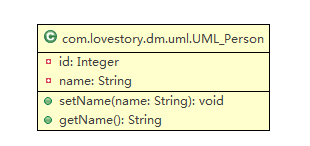
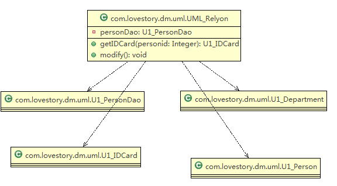
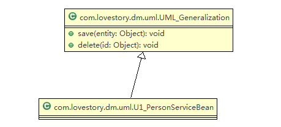
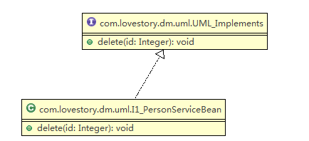
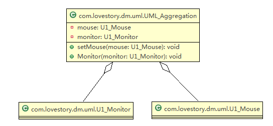
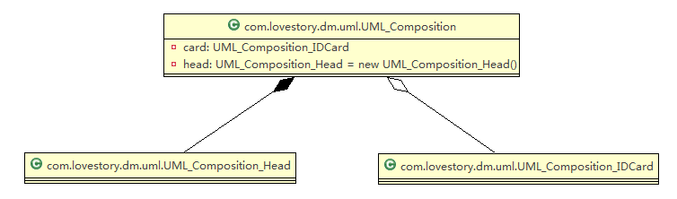

## 一 UML基础

### 1 UML简介

（1）UML

UML（Unified modeling language，统一建模语言)，是一种用于软件系统分析和设计的语言工具，它用于帮助软件开发人员进行思考和记录思路的结果。

UML 本身是一套符号的规定，就像数学符号和化学符号一样，这些符号用于描述软件模型中的各个元素和他们之间的关系，比如类、接口、实现、泛化、依赖、组合、聚合等。

使用 UML 来建模，常用的工具有 Rational Rose , 也可以使用一些插件来建模。

（2）示例


### 2 UML图

画 UML 图是把自己的思想描述给别人看，关键在于思路和条理。

UML图分类:

（1）用例图（use case）。

（2）静态结构图：类图、对象图、包图、组件图、部署图。

（3）动态行为图：交互图（时序图与协作图）、状态图、活动图。

**说明：类图是描述类与类之间的关系的，是 UML 图中最核心的。**

（1）类图是描述类与类之间的关系的，是 UML 图中最核心的。


### 3  UML类图

**注：本节实例参看工程中com.lovestory.dm.uml包**


#### 3.1 UML类图

用于描述系统中的类(对象)本身的组成和类(对象)之间的各种静态关系。

类之间的关系包括：依赖、泛化（继承）、实现、关联、聚合与组合。

（1）代码

```java
UML_Person.java

package com.lovestory.dm.uml;

public class UML_Person {
	private Integer id;
	private String name;

	public void setName(String name) {
		this.name = name;
	}

	public String getName() {
		return this.name;
	}
}

```

新建一个uml的类图文件，然后将java文件拖入编辑视图中，即可自动生成该java类的类图。

（2）UML类图




#### 3.2 依赖关系

只要是在类中用到了对方，他们之间就存在依赖关系。

（1）代码

```java
UML_Relyon.java

package com.lovestory.dm.uml;

public class UML_Relyon {
	private U1_PersonDao personDao;// 类public void save(Person person){}

	public U1_IDCard getIDCard(Integer personid) {
		return null;
	}

	public void modify() {
		U1_Department department = new U1_Department();
	}

}

class U1_PersonDao {
}

class U1_IDCard {
}

class U1_Person {
}

class U1_Department {
}
```


（2）UML类图




（3）总结

* 类中用到了对方。
* 类的成员属性。
* 类中方法的返回类型。
* 类中方法接收的参数类型。
* 类中方法使用到的。


#### 3.3 泛化关系

泛化关系实际上就是继承关系，是依赖关系的特例。

（1）代码

```java
UML_Generalization.java
    
package com.lovestory.dm.uml;

public abstract class UML_Generalization {
	public void save(Object entity) {
	}

	public void delete(Object id) {
	}

}

class U1_PersonServiceBean extends UML_Generalization {
}
```


（2）UML类图



（3）总结

* 泛化关系实际上就是继承关系。
* 如果A类继承了B类，就说A和B存在泛化关系。


#### 3.4 实现关系

实现关系实际上就是A类实现B接口，是依赖关系的特例。

（1）代码

```java
UML_Implements.java

package com.lovestory.dm.uml;

public interface UML_Implements {
	public void delete(Integer id);
}

class I1_PersonServiceBean implements UML_Implements {
	public void delete(Integer id) {
	}
}
```


（2）UML类图




#### 3.5 关联关系

关联关系实际上是类与类之间的联系，是依赖关系的特例。

关联具有导航性，即双向关系或单向关系。

关系具有多重性，即有且仅有一个，或者没有关系，或者多个关系。

（1）单向一对一

```java
public class Person {
    private IDCard card;
}
public class IDCard {}
```

（2）双向一对一

```java
public class Person {
    private IDCard card;
}
public class IDCard {
    private Person person;
}
```


#### 3.6 聚合关系

（1）简介

聚合关系（Aggregation）表示的是整体和部分的关系，**整体与部分可以分开**。

聚合关系是关联关系的特例，所以他具有关联的导航性（谁聚合到谁那里）与多重性。

如：一台电脑由键盘(keyboard)、显示器(monitor)，鼠标等组成；组成电脑的各个配件是可以从电脑上分离出来的，使用带空心菱形的实线来表示：


（2）代码

```java
package com.lovestory.dm.uml;

public class UML_Aggregation {
	private U1_Mouse mouse;
	private U1_Monitor monitor;

	public void setMouse(U1_Mouse mouse) {
		this.mouse = mouse;
	}

	public void Monitor(U1_Monitor monitor) {
		this.monitor = monitor;
	}
}

class U1_Mouse {

}

class U1_Monitor {

}
```


（3）UML类图




#### 3.7 组合关系

（1）简介

组合关系：也是整体与部分的关系，但是**整体与部分不可以分开**。


（2）代码

````java
UML_Composition.java
    
package com.lovestory.dm.uml;

public class UML_Composition {
	private UML_Composition_IDCard card;
	private UML_Composition_Head head = new UML_Composition_Head();
}

class UML_Composition_IDCard {
}

class UML_Composition_Head {
}
````


（3）UML类图



