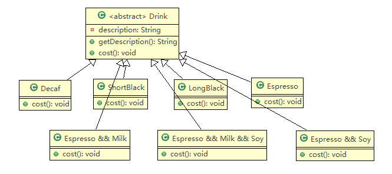
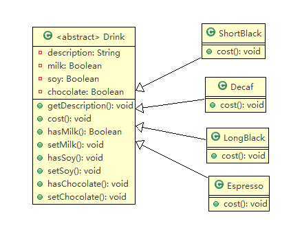
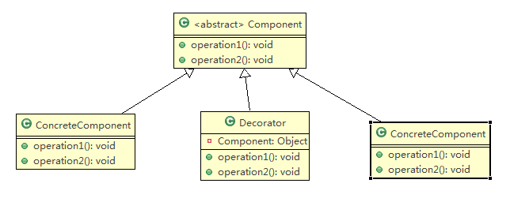
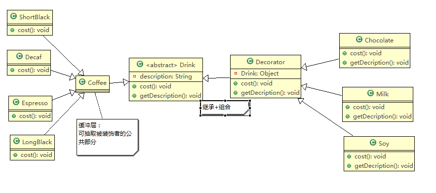
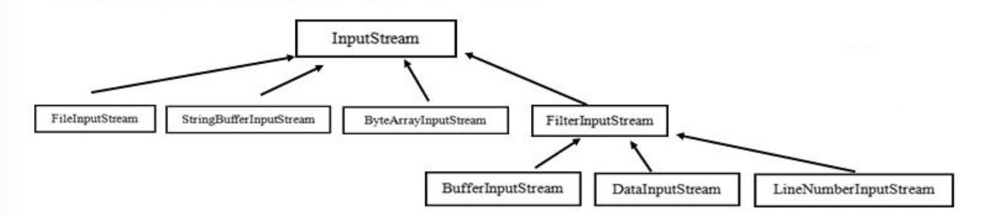

<h1 style="text-align:center;">装饰者模式</h1>

## 1 案例分析

### 1.1 咖啡订单项目

咖啡种类：Espresso(意大利浓咖啡)、ShortBlack、LongBlack(美式咖啡)、Decaf(无因咖啡)

调料：Milk、Soy(豆浆)、Chocolate

要求在扩展新的咖啡种类时，具有良好的扩展性、改动方便、维护方便。

使用 OO 的方法来计算不同种类咖啡的费用:  客户可以点单品咖啡，也可以单品咖啡+调料组合。

### 1.2 方案1

分析：

Drink 是一个抽象类，表示饮料。

description 就是对咖啡的描述，比如咖啡的名字。

cost() 方法就是计算费用，Drink 类中做成一个抽象方法。

Decaf 就是单品咖啡，继承 Drink，并实现 cost。

Espress && Milk 就是单品咖啡+调料， 这个组合很多。

问题：这样设计，每当增加一个单品咖啡或者一个新的调料，就会产生很多类，出现类爆炸。

### 1.3 方案2

方案1中咖啡和调料的组合会造成类的倍增，可以通过将调料内置到Drink类中，从而提高项目维护性。

分析：

该方案可以控制类的数量，不至于造成类的数量倍增。

在增加或者删除调料种类时，代码的维护量比较大。

考虑到用户可以添加多份 调料时，可以将 hasMilk 返回一个对应 int

## 2 装饰者模式

### 2.1 定义

**装饰者模式：**动态的将新功能附加到对象上。

在对象功能的扩展方面，它比继承更有弹性，装饰者模式也体现了开闭原则（OCP）。

### 2.2 原理

#### 2.2.1 引入

可以把装饰者模式比作打包一个快递。

主体（被装饰者）：比如陶瓷、衣服 （Component）。

包装（装饰者Decorator）：比如报纸填充、塑料泡沫、纸板、木板。

Component 主体：比如类似前面的 Drink。

ConcreteComponent：具体的主体， 比如前面的各个单品咖啡。

Decorator：装饰者，比如各种调料。

在如图的 Component 与 ConcreteComponent 之间，如果 ConcreteComponent 类很多，还可以设计一个缓冲层，将共有的部分提取出来，抽象成一个类。

#### 2.2.2 咖啡订单方案

说明：

Drink类为抽象类，ShortBlack为单品咖啡，Decorator是一个装饰类，含有一个被装饰的对象，Decorator的cost方法进行一个费用的叠加计算，递归计算价格。

比如2份巧克力+1份牛奶+LongBlack，则Milk包裹了一份单品咖啡，一份巧克力包裹了一份单品咖啡和一份milk，另一份巧克力包裹了一份巧克力、单品咖啡和milk。

#### 2.2.3 代码实现

**注：本节实例参看工程中com.lovestory.dm.structure_dm.decorator包**

略

##  3 IO源码

Java的IO就是利用了装饰者模式，FilterInputStream就是一个装饰者。

说明：
（1）InputStream 是抽象类,  类似前面的 Drink。

（2）FileInputStream是InputStream  子类，类似前面的 DeCaf, LongBlack

（3）FilterInputStream是InputStream 子类，类似前面的Decorator 修饰者。

（4）DataInputStream  是 FilterInputStream  子类，具体的修饰者，类似前面的 Milk, Soy 等。

（5）FilterInputStream 类 有protected volatile InputStream in;即包含被装饰者。

