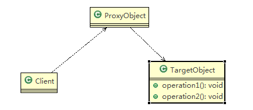
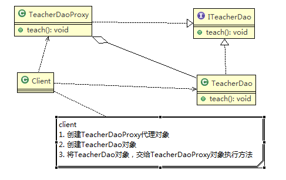
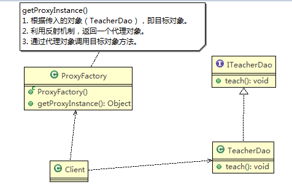
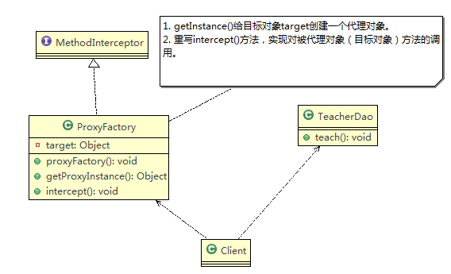

## 一 代理模式

### 1 代理模式

代理模式是为一个对象提供一个替身，以控制对这个对象的访问。

通过代理对象访问目标对象，可以在目标对象实现的基础上，增强额外的功能操作，即扩展目标对象的功能。

被代理的对象可以是远程对象、创建开销大的对象或需要安全控制的对象。


### 2 代理模式分类

代理模式有多种不同的形式，主要有三种

* 静态代理

* 动态代理（JDK 代理、接口代理）

  包括JDK代理（接口代理）和Cglib代理（可在内存动态创建对象，而不需要实现接口）


### 3 示例




## 二 静态代理

**注：本节实例参看工程中com.lovestory.dm.structure_dm.proxy.static_proxy包**


### 1 静态代理模式简介

静态代理在使用的时候，需要定义接口或者父类，被代理对象（目标对象）与代理对象一起实现相同的接口或者继承相同的父类。


### 2 应用实例

#### 2.1 具体要求

（1）定义一个接口 ITeacherDao。

（2）目标对象 TeacherDAO 实现接口 ITeacherDAO。

（3）使用静态代理方式，就需要在代理对象 TeacherDAOProxy 中也实现 ITeacherDAO。

（4）调用的时候通过调用代理对象的方法来调用目标对象。

**注意：代理对象与目标对象要实现相同的接口，然后通过调用相同的方法来调用目标对象的方法。**


#### 2.2 思路分析



#### 2.3 代码实现

```java
package com.lovestory.dm.structure_dm.proxy.static_proxy;

public interface SP_ITeacherDao {
	void teach();
}

public class SP_TeacherDao implements SP_ITeacherDao {

	@Override
	public void teach() {
		System.out.println("老師授課中。。。");
	}

}

// 静态代理
public class SP_TeacherDaoProxy implements SP_ITeacherDao {
	private SP_ITeacherDao target;  // 目标对象，通过接口聚合
	
	public SP_TeacherDaoProxy(SP_ITeacherDao target) {
		super();
		this.target = target;
	}

	@Override
	public void teach() {
		System.out.println("代理开始。。。");
		this.target.teach();
		System.out.println("代理结束。。。");
	}

}

public class SP_Client {

	public static void main(String[] args) {
		// 创建目标对象
		SP_ITeacherDao target = new SP_TeacherDao();
		// 创建代理对象，将被代理对象传递给代理对象
		SP_TeacherDaoProxy proxy = new SP_TeacherDaoProxy(target);
		// 通过代理对象，调用到被代理对象的方法
		// 执行的是代理对象的方法，代理对象再去调用目标对象的方法
		proxy.teach();
	}

}

```


#### 2.4 静态代理优缺点

（1）优点

在不修改目标对象的功能前提下, 能通过代理对象对目标功能扩展。

（2）缺点

因为代理对象需要与目标对象实现一样的接口，所以会出现很多代理类。

一旦接口增加方法，目标对象与代理对象都要维护。


## 三 动态代理

### 1 动态代理简介

代理对象不需要实现接口。


### 2 JDK代理

**注：本节实例参看工程中com.lovestory.dm.structure_dm.proxy.jdk_proxy包**


#### 2.1 JDK动态代理

目标对象要实现接口。

代理对象的生成是利用 JDK 的 API，动态的在内存中构建代理对象。

#### 2.2 JDK生成代理对象API

代理类所在包：`java.lang.reflect.Proxy`。

JDK 实现代理只需要使用 newProxyInstance 方法，但是该方法需要接收三个参数，完整的写法是：

```java
static Object newProxyInstance(ClassLoader loader, Class<?>[] interfaces,InvocationHandler h )
```

#### 2.3 应用实例

##### 2.3.1 具体要求

将上述静态代理改进成动态代理模式

##### 2.3.2 思路分析



##### 2.3.3 代码实现

```java
package com.lovestory.dm.structure_dm.proxy.jdk_proxy;

public interface JDK_ITeacherDao {
	void teach();
}

public class JDK_TeacherDao implements JDK_ITeacherDao {

	@Override
	public void teach() {
		System.out.println("老師授課中。。。");
	}

}

import java.lang.reflect.InvocationHandler;
import java.lang.reflect.Method;
import java.lang.reflect.Proxy;

public class JDK_ProxyFactory {

	// 维护一个目标对象
	private Object target;

	// 構造器，對target進行初始化
	public JDK_ProxyFactory(Object target) {
		this.target = target;
	}

	// 给目标对象生成一个代理对象
	public Object getProxyInstance() {
		// 说明
		// 方法： public static Object newProxyInstance(ClassLoader loader,Class<?>[]
		// interfaces, InvocationHandler h)
		// loader： 指定当前目标对象使用的类加载器，获取加载器方法，固定的
		// interfaces：目标对象实现的接口类型，使用泛型方式确认类型
		// h：事件处理，执行目标对象的方法时，会触发事件处理器的方法，把当前执行的目标对象的方法作为参数传入
		return Proxy.newProxyInstance(target.getClass().getClassLoader(), target.getClass().getInterfaces(),
				new InvocationHandler() {

					@Override
					public Object invoke(Object proxy, Method method, Object[] args) throws Throwable {
						System.out.println("JDK代理开始。。。");
						// 反射机制调用目标对象的方法
						Object retVal = method.invoke(target, args);
						return retVal;
					}
				});
	}
}

public class JDK_Client {

	public static void main(String[] args) {
		// 创建目标对象
		JDK_ITeacherDao target = new JDK_TeacherDao();
		// 创建代理对象
		JDK_ITeacherDao proxyInstance =(JDK_ITeacherDao) new JDK_ProxyFactory(target).getProxyInstance();
        // 内存中生成了代理对象
		System.out.println("proxyInstance=" + proxyInstance.getClass());  // proxyInstance=class com.sun.proxy.$Proxy0
		proxyInstance.teach();
	}

}
```


### 3 Cglib代理

**注：本节实例参看工程中com.lovestory.dm.structure_dm.proxy.cglib_proxy包**


#### 3.1 Cglib代理

（1）静态代理和 JDK 代理模式都要求目标对象实现一个接口，但是有时候目标对象只是一个单独的对象，并没有实现任何的接口。

这个时候可使用目标对象子类来实现代理，这就是Cglib代理。

（2）Cglib 代理也叫作子类代理，它是在内存中构建一个子类对象，从而实现对目标对象功能扩展。

（3）Cglib 是一个强大的高性能的代码生成包，它可以在运行期扩展 java 类与实现 java 接口。

它广泛的被许多 AOP 的框架使用，例如，Spring AOP实现方法拦截。

（4）在 AOP 编程中如何选择代理模式

* 目标对象需要实现接口，用 JDK 代理

* 目标对象不需要实现接口，用 Cglib 代理

（5）Cglib 包的底层是通过使用字节码处理框架 ASM 来转换字节码并**生成新的类**。


#### 3.2 Cglig实现步骤

（1）需要引入cglib的jar文件。

（2）在内存中动态构建子类，**被代理的类不能为final**。

（3）目标对象的方法如果为final或static，就不会被拦截，即不会执行目标对象额外的业务方法。


#### 3.3 应用实例

##### 3.3.1 具体要求

将上述静态代理改进成动态代理模式


##### 3.3.2 思路分析



##### 3.3.3 代码实现

```java
package com.lovestory.dm.structure_dm.proxy.cglib_proxy;

public class CG_TeacherDao {

	public void teach() {
		System.out.println("老師授課中。。。");
	}

}

import java.lang.reflect.Method;

import net.sf.cglib.proxy.Enhancer;
import net.sf.cglib.proxy.MethodInterceptor;
import net.sf.cglib.proxy.MethodProxy;

public class CG_ProxyFactory implements MethodInterceptor {

	// 维护一个目标对象
	private Object target;

	// 构造器，对target进行初始化
	public CG_ProxyFactory(Object target) {
		this.target = target;
	}

	// 给目标对象生成一个代理对象
	public Object getProxyInstance() {
		// 1. 创建一个工具类
		Enhancer enhancer = new Enhancer();

		// 2. 设置父类
		enhancer.setSuperclass(target.getClass());

		// 3. 设置回调函数
		enhancer.setCallback(this);

		// 4. 创建子类对象，即代理对象
		return enhancer.create();
	}

	// 重写intercept方法，实现对被代理对象的方法的调用
	@Override
	public Object intercept(Object arg0, Method method, Object[] args, MethodProxy arg3) throws Throwable {
		System.out.println("cglib代理开始。。。");
		Object invoke = method.invoke(target, args);
		System.out.println("cglib代理结束。。。");
		return invoke;
	}
}

public class CG_Client {

	public static void main(String[] args) {
		// 创建目标对象
		CG_TeacherDao target = new CG_TeacherDao();
		// 创建代理对象
		CG_TeacherDao proxyInstance =(CG_TeacherDao) new CG_ProxyFactory(target).getProxyInstance();
        // proxyInstance=class com.lovestory.dm.structure_dm.proxy.cglib_proxy.CG_TeacherDao$$EnhancerByCGLIB$$263b3e2f
		System.out.println("proxyInstance=" + proxyInstance.getClass());
		// 执行代理对象的方法，触发intercept方法，从而实现对目标对象的调用。
		proxyInstance.teach();
	}

}

```


## 四 代理变体

### 1 防火墙代理

内网通过代理穿透防火墙，实现对公网的访问。

### 2 缓存代理

比如：当请求图片文件等资源时，先到缓存代理取，如果取到资源则 ok,如果取不到资源，再到公网或者数据库取，然后缓存。

### 3 远程代理

远程对象的本地代表，通过它可以把远程对象当本地对象来调用。

远程代理通过网络和真正的远程对象沟通信息。

### 4 同步代理

主要使用在多线程编程中，完成多线程间同步工作同步代理。